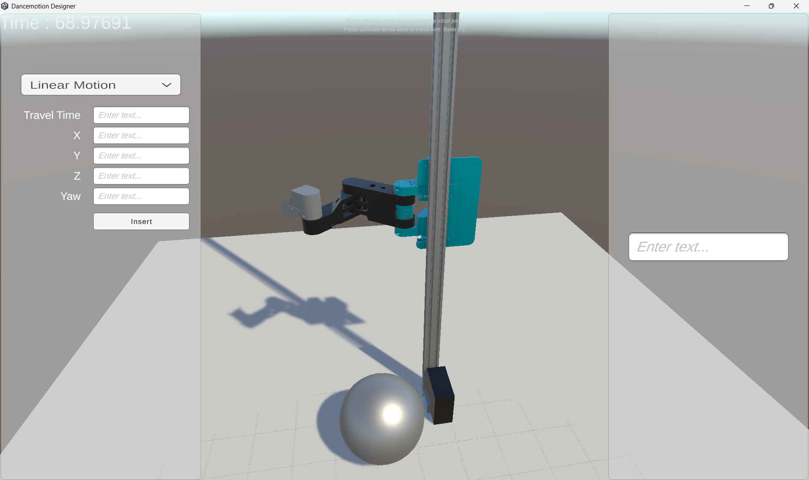

# DanceMotion Designer

**DanceMotion Designer** is a software tool developed as part of a 4-DOF SCARA arm project. It assists users in creating motion planning for the robot and acts as a digital twin, providing a virtual representation of the robot's movements.  

This project utilizes the **URDF Importer** from Unity Technologies:  
[URDF Importer GitHub](https://github.com/Unity-Technologies/URDF-Importer)

Even though it's still an ongoing project, **See it in action:** [Video Demo](https://drive.google.com/file/d/1-XAz4PoQ7R4TTsYWVqks0WnSb4THLKnb/view?usp=sharing)
